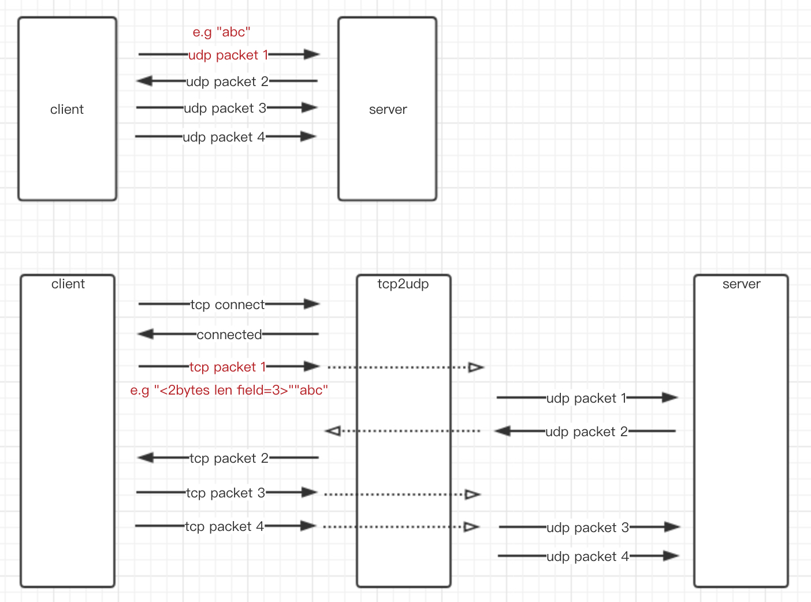

# tcp2udp

一个架设在udp服务器前的tcp代理模块。

**简介**

假设你有一个udp server，但是由于某种原因在某些场景下无法使用udp协议（比如说某个客户端udp协议被禁用）。
那么我们可以通过在udp server前布置一个代理模块(tcp2udp)来解决这个问题。
代理模块接收客户端的tcp连接请求，
左手将从客户端收到的tcp数据转换成udp发送给udp server，右手再将从udp server收到的udp数据转换成tcp发送给对应的客户端链接。

**适配**

1. 原udp server不需要修改
2. 原应用层协议不需要修改
3. 原客户端需在发送数据时适配成tcp发送

**注意**

udp的消息格式是段式的，接收端是一包一包的收，收到的大小是多少，这一包就是多少。
而tcp是流式的，如果我们直接把udp的多个包使用一个tcp链接发送，那么tcp2udp可能无法拆解成多个udp包（即tcp的粘包问题）。
所以我们在使用tcp发送时，在每个包前增加2个字节的长度字段。同样的，tcp2udp给客户端转发udp server的数据时，也增加长度字段。

**特性**

* 支持多链接映射
* 支持分别设置tcp端和udp端的收数据超时时间，超时后关闭自身链接和对应的链接
* 支持hook两个方向的数据，业务方可对数据包做解析，并决定这包数据是否做转发或者直接关闭链接

**依赖**

无依赖

**图**

